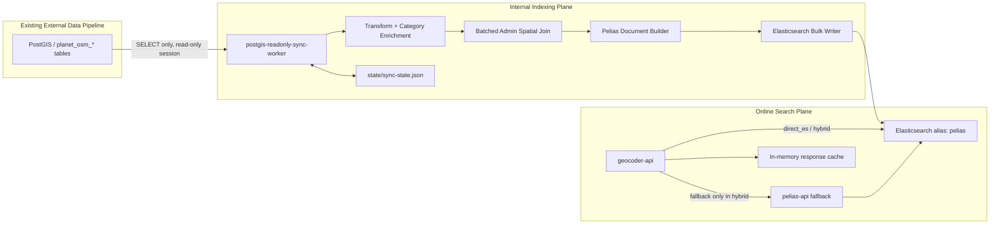
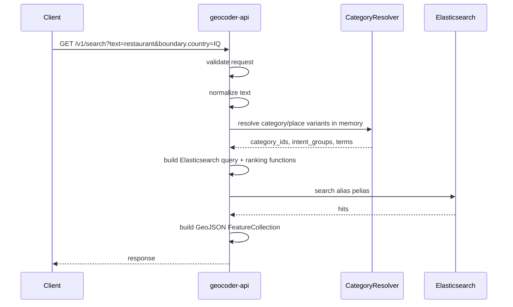
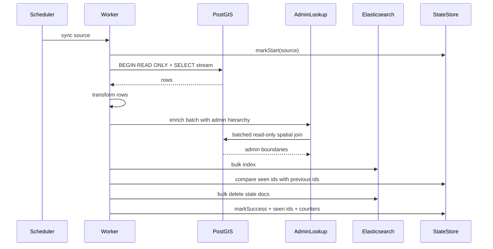

# TavrixMap Geocoder - Software Architecture Review README

هذا الملف موجه للـ Software Architect لتقييم مشروع **TavrixMap Geocoder** من ناحية البنية، حدود المسؤوليات، تدفق البيانات، الأمان، الأداء، جودة البحث، قابلية التوسع، ومخاطر الانتقال من MVP إلى Production.

الوثيقة تصف التنفيذ الحالي، وليس مجرد تصميم نظري. المشروع مبني كـ **Pelias-compatible geocoder**، وليس نسخة strict من upstream Pelias. الهدف هو توفير واجهة بحث جغرافي عامة وسريعة تعتمد على Elasticsearch وقت الطلب، مع عامل مزامنة داخلي يقرأ من PostGIS بشكل read-only ويفهرس البيانات إلى Elasticsearch.

---

## 1. Executive Summary

المشروع عبارة عن Geocoder داخلي/عام لـ TavrixMap، يقدم endpoints شبيهة بـ Pelias:

- `/v1/search`
- `/v1/autocomplete`
- `/v1/reverse`
- `/v1/place`
- `/v1/search/structured`
- `/v1/nearby`
- `/v1/categories`
- `/v1/debug/normalize`
- `/v1/debug/explain`
- `/v1/index/stats`
- health and metrics endpoints

المبدأ المعماري الأساسي:

> **Public API must never query PostGIS at request time.**

لذلك يتم تقسيم النظام إلى مسارين واضحين:

1. **Online query path**
   - يستقبل طلبات المستخدم.
   - يقرأ من Elasticsearch فقط.
   - لا يفتح اتصال PostgreSQL/PostGIS.
   - لا يعتمد على Wikidata أو APIs خارجية وقت الطلب.

2. **Offline / scheduled indexing path**
   - Worker داخلي فقط.
   - يفتح اتصال read-only مع PostGIS.
   - يقرأ sources محددة باستخدام `SELECT` فقط.
   - يطبق transform, admin enrichment, category enrichment.
   - يكتب documents إلى Elasticsearch.
   - يدير deletes و blue/green reindex.

---

## 2. Repository Layout

```text
TavrixMapGeocoder/
  config/
    pelias-postgis-readonly-sync.json   # Source SQL, schedules, admin enrichment, ES aliases
    category-taxonomy.json              # Category taxonomy, aliases, Arabic/Iraqi/Kurdish synonyms
    ranking.json                        # Ranking weights and proximity boosts
    categories.json                     # Legacy/simple categories config
    layers.json                         # Layer metadata
    sources.json                        # Source metadata
    synonyms/
      ar.json
      en.json
      ku.json

  docs/
    openapi.json                        # Existing public OpenAPI contract

  generated/
    category-labels.wikidata.json       # Offline generated Wikidata category labels
    wikidata-cache/                     # Local cache, ignored by git

  geocoder-api/
    src/
      app.js                            # Express API routes and query dispatch
      config.js                         # Runtime config/env loader
      ranking.js                        # Elasticsearch query builder and ranking formula
      category-resolver.js              # In-memory taxonomy/category resolver
      query-expansion.js                # Query expansion using CategoryResolver
      normalizer.js                     # Arabic/Kurdish/English normalization
      es-service.js                     # Elasticsearch access and index stats
      feature-builder.js                # ES hit -> GeoJSON Feature
      response-enricher.js              # Response-level enrichment
      response-cache.js                 # TTL response cache + inflight dedupe
      middleware.js                     # Request id, access logs, internal token gates
      pelias-client.js                  # Optional upstream Pelias fallback client
      validation.js                     # Request validation

    scripts/
      build-category-wikidata.js        # Offline Wikidata taxonomy label builder
      quality-gate.js                   # Relevance + p95 latency gate

    test/
      api.test.js
      ranking.test.js
      performance.test.js
      e2e-quality.test.js
      postgis-isolation.test.js
      category-resolver.test.js
      query-expansion.test.js
      routing-integration.test.js
      ...

  sync-worker/
    src/
      index.js                          # Worker command entrypoint and sync orchestration
      postgis-reader.js                 # Read-only PostGIS streaming reader
      config-validator.js               # Sync config schema + SELECT-only SQL guard
      transform.js                      # PostGIS row -> domain document
      admin-lookup.js                   # Batched admin hierarchy spatial join
      category-taxonomy.js              # Index-time category enrichment
      pelias-document-builder.js        # Domain doc -> Pelias-compatible ES document
      es-writer.js                      # Bulk index/delete writer with retry and DLQ samples
      index-manager.js                  # Mappings, aliases, blue/green index management
      state-store.js                    # Sync state, seen ids, run history, failed samples
      health-server.js                  # Internal worker health/control endpoints
      scheduler.js                      # Cron scheduling
      metrics.js                        # Prometheus metrics

    test/
      sync-service.test.js
      admin-lookup.test.js
      config-validator.test.js
      postgis-reader.test.js
      index-manager.test.js
      es-writer.test.js
      ...

  docker-compose.yml                    # Runtime service topology
  pelias.json                           # Pelias API config
  pelias-schema-init.json               # Pelias schema init config
  README.md                             # Operational README
```

---

## 3. Runtime Services

The Docker Compose stack defines these services:

| Service | Responsibility | Publicly exposed |
|---|---|---|
| `elasticsearch` | Pelias-compatible search index | Yes in local compose: `9200`, `9300` |
| `pelias-schema` | Initializes Pelias index if needed | No |
| `libpostal` | Address parsing service used by Pelias API | Local exposed: `4400` |
| `pelias-api` | Upstream Pelias-compatible API inside network | No direct host port |
| `geocoder-api` | TavrixMap public geocoder gateway | Yes: `${PELIAS_API_PORT:-4000}` |
| `swagger-ui` | OpenAPI UI | Yes: `${SWAGGER_PORT:-8088}`, local env may override to `8099` |
| `postgis-readonly-sync-worker` | Internal read-only PostGIS sync/index worker | Internal Docker `expose: 9090`, no host `ports` |

Important network boundary:

- `postgis-readonly-sync-worker` joins the default network and the external PostGIS Docker network.
- `geocoder-api` does **not** join the external PostGIS network.
- Worker port `9090` uses `expose`, not `ports`, so it is reachable inside Docker network only.

---

## 4. High-Level Architecture



---

## 5. Critical Architectural Constraints

### 5.1 Public API isolation

The public geocoder API must never connect to PostGIS. Its runtime dependencies are:

- Elasticsearch client via `@elastic/elasticsearch`
- optional Pelias API HTTP client in `hybrid`/`pelias` modes
- local config files
- read-only worker state file mounted as `/app/state/sync-state.json`

The API service has no PostgreSQL package dependency and no PostGIS network attachment.

### 5.2 Worker is the only PostGIS client

The sync worker is the only service that imports PostgreSQL libraries:

- `pg`
- `pg-query-stream`

The worker:

- requires `POSTGIS_HOST`, `POSTGIS_DB`, `POSTGIS_USER`, `POSTGIS_PASSWORD`.
- sets PostgreSQL connection option `default_transaction_read_only=on`.
- starts source reads with `BEGIN READ ONLY`.
- verifies the session using `SHOW transaction_read_only`.
- executes configured source SQL through streaming read-only queries.

### 5.3 PostGIS is source-of-truth, not mutable state

The project does not write to PostGIS. It does not:

- create triggers
- create tables
- maintain outbox rows
- write sync metadata to PostGIS
- modify `planet_osm_*`

Sync metadata lives outside PostGIS in `state/sync-state.json`.

### 5.4 OpenAPI contract stability

The OpenAPI contract is stored in:

```text
docs/openapi.json
```

The current implementation treats this contract as source of truth for public behavior. Architecture changes should not casually add public endpoints or change response shapes without updating product/API governance.

---

## 6. Request-Time Query Flow

For normal public requests:



No PostGIS read occurs in this flow.

---

## 7. Query Modes

`GEOCODER_QUERY_MODE` supports:

| Mode | Behavior |
|---|---|
| `direct_es` | API builds Elasticsearch queries directly. |
| `pelias` | API forwards supported requests to upstream Pelias API. |
| `hybrid` | Try direct Elasticsearch first; fallback to Pelias API on error. |

The Docker default is:

```text
GEOCODER_QUERY_MODE=hybrid
```

Production recommendation:

- Use `direct_es` when TavrixMap ranking and taxonomy behavior must be deterministic.
- Use `hybrid` during transition periods.
- Keep `pelias` only as compatibility fallback/testing mode.

---

## 8. Public API Endpoints

### 8.1 Search

`GET /v1/search`

Capabilities:

- free text search
- Arabic/Kurdish/English normalization
- category synonym expansion
- `boundary.country` filter
- focus-point ranking
- layer/source/category filters
- response dedupe
- `response_mode=standard|full|debug`

Elasticsearch fields searched include:

- `name.default`
- `label`
- `names.*`
- `name.ar`
- `name.en`
- `name.ku`
- `name.ckb`
- `phrase.*`
- admin fields such as locality and region
- `category`
- `categories`
- `category_ids`
- `category_terms`
- `intent_groups`
- `category_aliases`
- `source_tags.amenity`
- `source_tags.shop`
- `source_tags.tourism`
- `source_tags.leisure`
- `source_tags.office`

### 8.2 Autocomplete

`GET /v1/autocomplete`

Also exposed as:

`GET /v1/suggest`

Autocomplete is intentionally optimized for latency:

- uses in-memory category resolver
- uses prefix-oriented ES query clauses
- limits category-term expansion
- uses response cache and in-flight request deduplication
- avoids wildcard/regexp/script_score queries

### 8.3 Reverse

`GET /v1/reverse`

Uses Elasticsearch geo distance queries over `center_point`, preferring venue/address/street style layers unless the caller specifies layers.

### 8.4 Place

`GET /v1/place?ids=...`

Resolves by:

- direct document IDs when supplied
- Pelias-like `source:layer:source_id`

Current document identity is:

```text
gid = osm_postgis:<layer>:<source_id>
_id = postgis:<source_config>:<source_id>
```

This separation matters:

- `_id` is internal Elasticsearch deterministic ID for sync/delete.
- `gid` is Pelias-compatible public identity.

### 8.5 Nearby

`GET /v1/nearby`

Supports:

- `point.lat`
- `point.lon`
- `radius`
- `categories`
- `category_mode=any|all`
- `sort=distance|relevance|hybrid`

### 8.6 Categories

`GET /v1/categories`

Returns taxonomy categories with:

- localized names
- aliases
- intent groups
- OSM tag filters
- available document counts from Elasticsearch

The response is cached.

### 8.7 Debug normalize

`POST /v1/debug/normalize`

Applies the same text normalization rules used by search. This is useful for verifying Arabic/Kurdish text handling.

### 8.8 Debug explain

`GET /v1/debug/explain`

Protected by:

- `Authorization: Bearer <INTERNAL_TOKEN>`
- or `x-internal-token: <INTERNAL_TOKEN>`

Returns:

- generated Elasticsearch query
- ranking formula
- scoring components
- applied filters
- `boundary_country`
- hit count before/after country filter
- sample hit fields including `country_a`, `source_config`, `admin_enrichment_status`
- category resolution output

### 8.9 Index stats

`GET /v1/index/stats`

Returns:

- total document count
- documents by layer
- documents by `source_config`
- documents by `country_a`
- documents missing `country_a` by layer
- documents missing `country_a` by source_config
- missing-country reasons and samples
- worker source freshness
- last indexed/deleted/failed counts
- alias/index health

---

## 9. Input Validation and Error Model

Request validation lives in:

```text
geocoder-api/src/validation.js
```

Common limits:

- `MAX_TEXT_LENGTH`, default `256`
- `MAX_STRUCTURED_FIELD_LENGTH`, default `128`
- `MAX_BATCH_SIZE`, default `100`
- `MAX_SIZE`, default `40`
- `MAX_NEARBY_RADIUS_METERS`, default `50000`

Errors use a structured JSON envelope:

```json
{
  "error": {
    "code": "invalid_request",
    "message": "Human readable message",
    "details": {}
  }
}
```

---

## 10. Text Normalization

Arabic/Kurdish/English normalization is implemented in:

```text
geocoder-api/src/normalizer.js
```

Index-time category term normalization is also applied in:

```text
sync-worker/src/category-taxonomy.js
```

Current rules include:

- Unicode NFKC normalization
- lowercase Latin text
- Arabic alef normalization:
  - `أ`, `إ`, `آ`, `ٱ` -> `ا`
- alef maqsura normalization:
  - `ى` -> `ي`
- hamza carrier normalization:
  - `ؤ` -> `و`
  - `ئ` -> `ي`
- Arabic/Kurdish/Persian kaf normalization:
  - `ک`, `ڪ`, related variants -> Arabic `ك`
- Arabic/Kurdish/Persian ya normalization:
  - `ی`, `ێ`, related variants -> Arabic `ي`
- remove tatweel/kashida:
  - `ـ`
- remove Arabic diacritics
- normalize Arabic and Persian digits to Latin digits
- normalize Arabic punctuation
- handle selected common Iraqi spelling variants, such as variants of Karrada, Basra, Nasiriyah, Diwaniyah, Samawah, Amarah, Kufa, Hilla, etc.

Important design decision:

- The core normalizer preserves `ة` instead of folding it to `ه`.
- More aggressive folding should be handled by search analyzers or controlled synonym expansions to avoid semantic overmatching.

---

## 11. Category and Synonym Architecture

Primary taxonomy file:

```text
config/category-taxonomy.json
```

The taxonomy contains:

- `version`
- supported `languages`
- `intent_groups`
- `categories`
- `place_variants`

Category examples:

- restaurant
- cafe
- pharmacy
- hospital
- hotel
- fuel/gas station
- barber/hairdresser
- bakery

Arabic/Iraqi synonyms include examples such as:

- `مطعم`, `مطاعم`, `اكل`, `أكل` -> restaurant
- `مقهى`, `كافيه`, `كافي` -> cafe
- `صيدلية`, `صيدليه`, `صيدليات` -> pharmacy
- `مستشفى` -> hospital
- `فندق` -> hotel
- `بنزين`, `محطة بنزين`, `وقود` -> fuel/gas_station
- `حلاق`, `صالون` -> barber/hairdresser
- `مخبز`, `فرن`, `صمون` -> bakery

Place variants include:

- Baghdad / Bagdad / بغداد
- Karrada / Karada / الكرادة
- Erbil / Arbil / Hawler / هەولێر / اربيل
- Basra / البصرة
- Najaf / النجف
- Mosul / الموصل
- Sulaymaniyah
- Karbala

### 11.1 Runtime category resolver

Implemented in:

```text
geocoder-api/src/category-resolver.js
```

Properties:

- loaded once at process startup
- in-memory term indexes
- in-memory prefix indexes
- bounded cache
- no external network calls at request time
- supports search and autocomplete modes
- returns:
  - matched category IDs
  - matched intent groups
  - category terms
  - query terms
  - source tags
  - place terms
  - confidence

### 11.2 Offline Wikidata label builder

Implemented in:

```text
geocoder-api/scripts/build-category-wikidata.js
```

Purpose:

- enrich category labels/aliases offline
- avoid runtime Wikidata calls
- cache raw QID responses under `generated/wikidata-cache`
- write safe generated labels to:

```text
generated/category-labels.wikidata.json
```

Command:

```bash
cd geocoder-api
npm run build:category-wikidata
```

Production note:

- Generated labels should be reviewed before global rollout.
- Broad aliases are filtered, but taxonomy quality is still a product/search relevance concern.

---

## 12. Ranking Architecture

Ranking is implemented in:

```text
geocoder-api/src/ranking.js
config/ranking.json
```

Current formula exposed by `/v1/debug/explain`:

```text
final_score = text_relevance
            + proximity_score
            + popularity_importance
            + category_boost
            + exact_name_boost
            + layer_boost
```

The actual Elasticsearch query uses `function_score`.

Ranking components:

| Component | Implementation |
|---|---|
| text relevance | ES `multi_match` over name, label, admin fields, category fields, OSM source tags |
| proximity | `gauss` decay over `center_point` when `focus.point` exists |
| proximity buckets | extra weights for documents within 5km, 25km, 100km |
| popularity | `field_value_factor` over `popularity` with `log1p` |
| importance | `field_value_factor` over `importance` with `log1p` |
| category boost | terms over `category_ids`, `categories`, `category`, taxonomy terms |
| intent boost | `intent_groups` terms |
| exact name boost | exact `name.default` term boost |
| layer boost | configured per layer in `ranking.json` |

Current proximity defaults:

```json
{
  "distance": {
    "enabled": true,
    "decay_km": 3,
    "offset_km": 0.2,
    "weight": 15,
    "proximity_boosts": [
      { "distance": "5km", "weight": 40 },
      { "distance": "25km", "weight": 15 },
      { "distance": "100km", "weight": 5 }
    ]
  }
}
```

Performance guardrail:

> Any relevance improvement that pushes p95 beyond the configured latency budget is rejected.

The quality gate enforces this through:

```bash
cd geocoder-api
npm run test:quality-gate
```

---

## 13. Elasticsearch Query Performance Strategy

The API intentionally avoids slow request-time patterns:

- no PostGIS request-time lookups
- no request-time external APIs
- no wildcard queries for general search
- no regexp queries
- no script_score
- bounded result sizes
- TTL response cache
- in-flight cache deduplication to avoid cache stampede
- category resolver is in-memory
- autocomplete expansion is limited

Current performance test coverage:

- 100 RPS search
- 300 RPS search
- 100 RPS autocomplete
- p95 failure threshold defaults:
  - search: `250ms`
  - autocomplete: `150ms`

Latest local quality gate result from the current implementation:

```text
100rps:              p50=8ms  p95=12ms  p99=19ms
300rps:              p50=8ms  p95=16ms  p99=23ms
autocomplete-100rps: p50=8ms  p95=11ms  p99=18ms
```

These numbers are local-environment dependent, but they show the current relevance changes stayed inside the speed budget.

---

## 14. Indexing Sources

Source config:

```text
config/pelias-postgis-readonly-sync.json
```

Enabled sources:

| Source config | Layer(s) | Table | Purpose |
|---|---|---|---|
| `osm_pois` | `venue` | `planet_osm_point` | Named POIs |
| `streets` | `street` | `planet_osm_line` | Named roads |
| `places` | `locality` | `planet_osm_point` | OSM place points |
| `admin_boundaries` | `country`, `region`, `county`, `locality`, `neighbourhood` | `planet_osm_polygon` | Admin hierarchy |
| `addresses` | `address` | `planet_osm_point` | Disabled placeholder |

The project explicitly does **not** index every `planet_osm_*` row.

### 14.1 POIs

Filter:

```sql
WHERE name IS NOT NULL
  AND name <> ''
  AND (
    amenity IS NOT NULL
    OR shop IS NOT NULL
    OR tourism IS NOT NULL
    OR leisure IS NOT NULL
    OR office IS NOT NULL
  )
```

This selects named POIs only.

### 14.2 Streets

Filter:

```sql
WHERE name IS NOT NULL
  AND name <> ''
  AND highway IN (
    'motorway', 'trunk', 'primary', 'secondary', 'tertiary',
    'unclassified', 'residential', 'service', 'living_street',
    'pedestrian'
  )
```

This selects named highways only.

### 14.3 Places

Filter:

```sql
WHERE place IN ('city', 'town', 'village', 'suburb', 'neighbourhood', 'hamlet')
  AND name IS NOT NULL
  AND name <> ''
```

### 14.4 Admin boundaries

Filter:

```sql
WHERE boundary = 'administrative'
  AND admin_level IN ('2', '4', '6', '8', '9', '10')
  AND name IS NOT NULL
  AND name <> ''
```

Admin level mapping:

| admin_level | Field/layer |
|---|---|
| `2` | country |
| `4` | region |
| `6` | county |
| `8` | locality |
| `9` | localadmin |
| `10` | neighbourhood |

---

## 15. PostGIS Read-Only Design

Implemented in:

```text
sync-worker/src/postgis-reader.js
sync-worker/src/config-validator.js
```

### 15.1 Connection-level protection

Worker connection options include:

```text
-c default_transaction_read_only=on
-c statement_timeout=<configured>
-c idle_in_transaction_session_timeout=<configured>
```

Each source stream starts with:

```sql
BEGIN READ ONLY;
SHOW transaction_read_only;
```

If the session is not read-only, the worker refuses to continue.

### 15.2 Config SQL guard

The config validator enforces:

- query must start with `SELECT`
- no semicolons
- no row-locking clauses such as `FOR UPDATE`
- blocks write/admin keywords:
  - `INSERT`
  - `UPDATE`
  - `DELETE`
  - `MERGE`
  - `COPY`
  - `CREATE`
  - `ALTER`
  - `DROP`
  - `TRUNCATE`
  - `GRANT`
  - `REVOKE`
  - `VACUUM`
  - `ANALYZE`
  - `LISTEN`
  - `NOTIFY`
  - `CALL`
- requires a `WHERE` clause for direct `planet_osm_*` reads

### 15.3 Required database grants

Recommended PostGIS role:

```sql
CREATE ROLE pelias_readonly LOGIN PASSWORD '<strong-password>';

GRANT CONNECT ON DATABASE gis TO pelias_readonly;
GRANT USAGE ON SCHEMA public TO pelias_readonly;

GRANT SELECT ON TABLE planet_osm_point TO pelias_readonly;
GRANT SELECT ON TABLE planet_osm_line TO pelias_readonly;
GRANT SELECT ON TABLE planet_osm_polygon TO pelias_readonly;

ALTER ROLE pelias_readonly SET default_transaction_read_only = on;
```

Optional, depending on actual schema:

```sql
GRANT SELECT ON ALL TABLES IN SCHEMA public TO pelias_readonly;
ALTER DEFAULT PRIVILEGES IN SCHEMA public
  GRANT SELECT ON TABLES TO pelias_readonly;
```

Do not grant write privileges.

---

## 16. Sync Worker Flow

Normal source sync:



Sync counters per source:

- `last_indexed_count`
- `last_deleted_count`
- `last_failed_count`
- `last_success_timestamp`
- `last_error`
- `seen_ids`

Failure samples are written to:

```text
state/failed-record-samples.jsonl
```

---

## 17. Transform Pipeline

Implemented in:

```text
sync-worker/src/transform.js
sync-worker/src/category-taxonomy.js
sync-worker/src/admin-lookup.js
sync-worker/src/pelias-document-builder.js
```

Pipeline:

1. Validate source row has stable ID.
2. Validate `_lat` and `_lon` from PostGIS wrapper query.
3. Build multilingual names from configured name fields.
4. Resolve layer, including `layer_map` for admin boundaries.
5. Extract OSM source tags.
6. Enrich categories using taxonomy.
7. Extract address fields.
8. Extract configured hierarchy fields.
9. Apply self-hierarchy for admin documents.
10. Run batched admin hierarchy enrichment.
11. Build Pelias-compatible Elasticsearch document.

---

## 18. Document Model

Built by:

```text
sync-worker/src/pelias-document-builder.js
```

Important identity fields:

```json
{
  "id": "123",
  "gid": "osm_postgis:venue:123",
  "source": "osm_postgis",
  "source_config": "osm_pois",
  "layer": "venue",
  "source_id": "123"
}
```

Elasticsearch `_id` is produced by the worker domain document:

```text
postgis:<source_config>:<source_id>
```

Example:

```text
postgis:osm_pois:123
```

This design allows:

- Pelias-compatible public identity through `gid`
- source-scoped delete handling through `_id`
- accurate internal stats through `source_config`
- stable public `source = osm_postgis`

### 18.1 Search fields

Indexed documents may include:

- `name`
- `names`
- `phrase`
- `label`
- `center_point`
- `routable_point`
- `routable_points`
- `entrances`
- `category`
- `categories`
- `category_ids`
- `category_aliases`
- `category_terms`
- `intent_groups`
- `source_tags`
- `popularity`
- `importance`
- `parent`
- top-level admin fields
- `address_parts`
- `addendum`
- `updated_at`

### 18.2 Admin hierarchy fields

When available:

- `country`
- `country_a`
- `region`
- `region_a`
- `county`
- `locality`
- `localadmin`
- `neighbourhood`

If country cannot be found:

```json
{
  "admin_enrichment_status": "missing_country",
  "admin_enrichment_reason": "no_covering_admin_boundary"
}
```

Documents are not dropped when admin enrichment is incomplete.

---

## 19. Admin Enrichment Design

Implemented in:

```text
sync-worker/src/admin-lookup.js
```

Config:

```json
{
  "admin_enrichment": {
    "enabled": true,
    "boundaries_source": "admin_boundaries",
    "country_admin_level": 2,
    "region_admin_level": 4,
    "county_admin_level": 6,
    "locality_admin_level": 8,
    "use_point_on_surface_for_polygons": true,
    "cache_enabled": true,
    "cache_grid_precision": 5
  }
}
```

The lookup uses batched spatial joins:

- input batch is converted into a `VALUES` table of points
- admin boundaries are selected from configured `admin_boundaries` SQL
- points are joined with boundaries using `ST_Covers`
- results are ordered by admin level and polygon area
- values are copied into `parent` and top-level document fields

This avoids one expensive query per document.

### 19.1 Why batched joins matter

A naive implementation would run:

```sql
SELECT ...
FROM admin_boundaries
WHERE ST_Contains(geom, point)
```

once per POI/street/place. That does not scale globally.

This implementation batches many points into one SQL query so PostGIS can use spatial indexes efficiently.

### 19.2 Spatial index requirements

The worker remains read-only and does not create indexes. A database owner/admin should create:

```sql
CREATE INDEX CONCURRENTLY IF NOT EXISTS planet_osm_polygon_way_gist
  ON planet_osm_polygon USING GIST (way);

CREATE INDEX CONCURRENTLY IF NOT EXISTS planet_osm_point_way_gist
  ON planet_osm_point USING GIST (way);

CREATE INDEX CONCURRENTLY IF NOT EXISTS planet_osm_line_way_gist
  ON planet_osm_line USING GIST (way);
```

For global data, additional partitioning or country/region scoped imports may be needed.

---

## 20. Boundary Country Filtering

Implemented in:

```text
geocoder-api/src/ranking.js
```

Behavior:

- `boundary.country` is normalized to uppercase.
- `boundary.country=iq` and `boundary.country=IQ` both become `IQ`.
- The filter uses `country_a` and `parent.country_a`.

Filter shape:

```json
{
  "bool": {
    "should": [
      { "term": { "country_a": "IQ" } },
      { "match": { "parent.country_a": "IQ" } }
    ],
    "minimum_should_match": 1
  }
}
```

This requires indexed documents to have country metadata. Missing `country_a` documents are counted in `/v1/index/stats`.

---

## 21. Delete Handling

Implemented in:

```text
sync-worker/src/index.js
sync-worker/src/es-writer.js
sync-worker/src/state-store.js
```

### 21.1 Source-scoped diff deletes

For normal source sync:

1. Worker reads current source rows.
2. It stores current seen IDs.
3. It loads previous seen IDs from state.
4. Missing IDs are considered stale.
5. Worker deletes only IDs matching:

```text
postgis:<source_config>:<source_id>
```

This prevents cross-source deletes.

### 21.2 Delete counters

State tracks:

- `last_deleted_count`
- `last_failed_count`
- failure samples

### 21.3 Source count safety

Before applying delete diffs, the worker checks abnormal source drops.

Global defaults:

```json
{
  "source_drop_min_previous_count": 100,
  "source_drop_max_ratio": 0.5
}
```

Source-specific overrides are supported:

- `drop_check_min_previous_count`
- `max_drop_ratio`
- `allow_count_drop`

If an unexpected drop occurs, state records:

```text
last_error.code = unexpected_source_drop
```

Readiness then reports `source_counts_ok = false`.

---

## 22. Blue/Green Reindex

Implemented in:

```text
sync-worker/src/index.js
sync-worker/src/index-manager.js
```

Command:

```bash
docker compose exec -T postgis-readonly-sync-worker npm run reindex:all
```

Flow:

1. Create next versioned index:

```text
pelias_vN
```

2. Ensure mappings.
3. Temporarily write all sources into the new index.
4. Skip source diff deletes during full rebuild.
5. Validate target index:
   - index exists
   - required aliases exist
   - document count is greater than zero
   - document count is not below expected unique indexed count
   - sample search returns at least one hit
6. Atomically switch aliases:
   - `pelias`
   - `pelias_write`
7. Keep old index for rollback.

Important detail:

- Validation uses `unique_indexed`, not raw bulk operation count, because OSM sources can contain duplicate IDs, especially line segments.

---

## 23. Elasticsearch Aliases and Mappings

Aliases:

| Alias | Purpose |
|---|---|
| `pelias` | Read alias used by API/Pelias |
| `pelias_write` | Write alias used by worker |

Versioned index pattern:

```text
pelias_v1
pelias_v2
pelias_v3
...
```

Mapping extensions are maintained by:

```text
sync-worker/src/index-manager.js
```

Key mapping additions:

- `id`
- `gid`
- `source_config`
- `country_a`
- `region_a`
- `admin_enrichment_status`
- `admin_enrichment_reason`
- `routable_point`
- `category_ids`
- `category_terms`
- `intent_groups`
- `source_tags.*`
- `importance`

---

## 24. Routable Point Strategy

Current behavior:

- If `domainDoc.routable_point` exists, it is indexed.
- Otherwise, `routable_point` falls back to `center_point`.
- Response includes `routable_point` so routing integrations can consume it.

Current status:

- This is a placeholder integration.
- True routing snap integration should later call a routing snap service or precompute nearest routable point offline during indexing.
- Public API still must not call routing services for each search result unless explicitly designed and budgeted.

---

## 25. Worker HTTP API

Worker endpoints live on internal Docker port `9090`.

They are not exposed through host `ports`.

Endpoints:

- `GET /health`
- `GET /health/live`
- `GET /health/ready`
- `GET /health/dependencies`
- `GET /metrics`
- `POST /worker/sync/:source`
- `POST /worker/reindex/:source`
- `POST /worker/reindex-all`
- `GET /worker/runs`
- `GET /worker/runs/:run_id`

Control endpoints require:

```text
Authorization: Bearer <WORKER_INTERNAL_TOKEN>
```

or:

```text
x-internal-token: <WORKER_INTERNAL_TOKEN>
```

If no token is configured, protected worker controls return 503.

If token is missing/invalid, they return 401.

---

## 26. State Management

State file:

```text
state/sync-state.json
```

Managed by:

```text
sync-worker/src/state-store.js
```

Stores:

- source sync timestamps
- source start/finish timestamps
- indexed/failed/deleted counts
- duration
- last error
- seen IDs
- failed sample path
- index version
- worker run history

Known limitation:

- JSON state is acceptable for MVP/small-medium datasets.
- For full-world production scale, move state to SQLite, PostgreSQL metadata DB, or Elasticsearch metadata index.

Reason:

- `seen_ids` for full-world OSM sources can become very large.
- JSON rewrite on every source completion can become expensive and fragile.

---

## 27. Health and Readiness

### 27.1 API readiness

`GET /health/ready`

Checks:

- Elasticsearch reachable
- alias exists
- index has documents
- worker is not stale
- source counts are OK

Response includes:

- documents
- alias
- index name
- stale sources
- per-source staleness fields through index stats

### 27.2 Worker readiness

Worker readiness checks:

- PostGIS read-only ping
- Elasticsearch ping
- aliases exist
- index has documents
- worker/source staleness
- source count drop status

### 27.3 Source freshness thresholds

Configured per source:

| Source | Current threshold |
|---|---|
| `osm_pois` | 12h (`43200`) |
| `streets` | 48h (`172800`) |
| `places` | 24h (`86400`) |
| `admin_boundaries` | 7d (`604800`) |
| `addresses` | 12h, disabled |

---

## 28. Observability

API:

- JSON access logs
- request ID propagation through `X-Request-ID`
- optional search text logging via `LOG_SEARCH_TEXT=true`
- Prometheus metrics endpoint at `/metrics`

Worker metrics include:

- sync duration
- rows read
- documents indexed
- documents failed
- documents deleted
- ES bulk duration
- PostGIS query duration
- current alias/index labels
- last success/error timestamps
- schedule status

DLQ/sample logging:

```text
state/failed-record-samples.jsonl
```

This file records transform errors, Elasticsearch bulk errors, delete guard failures, and retry exhaustion samples.

---

## 29. Caching

Implemented in:

```text
geocoder-api/src/response-cache.js
```

Cache layers:

| Cache | Default TTL | Purpose |
|---|---:|---|
| Search/autocomplete | 5s | Smooth repeated user queries and perf tests |
| Categories | 300s | Avoid repeated category-count aggregation |
| Index stats | 30s | Avoid repeated heavy stats aggregations |

Search cache includes in-flight deduplication:

- if multiple identical requests arrive concurrently, only one Elasticsearch request is made.
- other callers await the same Promise.

---

## 30. Security Model

### 30.1 Network isolation

- Public host port: `geocoder-api`.
- Worker control port: Docker internal only.
- PostGIS access: worker only through external Docker network.
- API does not connect to PostGIS network.

### 30.2 Tokens

Internal debug/control access requires:

- `INTERNAL_TOKEN`
- or `WORKER_INTERNAL_TOKEN`

Protected API behavior:

- `/v1/debug/explain` requires token.
- `response_mode=debug` requires token.
- Worker control endpoints require token.

### 30.3 Sensitive data

Recommendations:

- never log DB passwords
- keep `.env` out of git
- rotate worker/internal tokens
- disable debug endpoints or protect them strongly in production
- do not expose Elasticsearch publicly in production
- place public API behind reverse proxy/API gateway/WAF/rate limiting

---

## 31. Environment Variables

Important API variables:

```text
PORT
PELIAS_API_URL
ELASTICSEARCH_URL
PELIAS_INDEX_ALIAS
GEOCODER_QUERY_MODE
MAX_BATCH_SIZE
MAX_SIZE
DEFAULT_SIZE
MAX_TEXT_LENGTH
MAX_NEARBY_RADIUS_METERS
DEFAULT_NEARBY_RADIUS_METERS
DEFAULT_LANG
DEFAULT_FALLBACK_LANG
SUPPORTED_LANGUAGES
ES_REQUEST_TIMEOUT_MS
API_REQUEST_TIMEOUT_MS
WORKER_STATE_PATH
SYNC_CONFIG_PATH
CATEGORY_TAXONOMY_PATH
CATEGORY_LABELS_PATH
RANKING_CONFIG_PATH
SEARCH_CACHE_TTL_MS
CATEGORIES_CACHE_TTL_MS
INDEX_STATS_CACHE_TTL_MS
INTERNAL_TOKEN
WORKER_INTERNAL_TOKEN
DEBUG_ENDPOINTS_ENABLED
EXPLAIN_ENDPOINT_ENABLED
LOG_SEARCH_TEXT
```

Important worker variables:

```text
POSTGIS_HOST
POSTGIS_PORT
POSTGIS_DB
POSTGIS_USER
POSTGIS_PASSWORD
POSTGIS_POOL_SIZE
POSTGIS_DOCKER_NETWORK
ELASTICSEARCH_URL
SYNC_CONFIG_PATH
SYNC_STATE_PATH
SYNC_FAILED_SAMPLE_PATH
HEALTH_PORT
WORKER_INTERNAL_TOKEN
DRY_RUN
```

---

## 32. Testing Strategy

### 32.1 API tests

Covered areas:

- search
- autocomplete
- reverse
- place
- nearby
- categories
- normalize
- debug explain auth
- ranking query construction
- query expansion
- category resolver
- response cache
- PostGIS isolation
- OpenAPI contract presence/compatibility
- E2E quality gate
- performance gate
- routing integration gate

### 32.2 Worker tests

Covered areas:

- config validation
- SQL read-only guard
- PostGIS reader behavior
- transform
- category enrichment
- admin lookup SQL
- ES writer bulk failures/retries
- delete handling
- source count drop detection
- blue/green reindex validation
- worker endpoint auth
- health server
- state store
- Docker Compose worker exposure

### 32.3 Test commands

API unit/integration tests:

```bash
cd geocoder-api
npm test
```

Worker tests:

```bash
cd sync-worker
npm test
```

Quality gate:

```bash
cd geocoder-api
npm run test:quality-gate
```

Routing integration test:

```bash
cd geocoder-api
npm run test:routing
```

Routing test requires a reachable Valhalla/routing service and is gated/skipped unless configured.

---

## 33. Current Verification Snapshot

Latest implementation verification from local run:

```text
sync-worker tests: 36 passed
geocoder-api tests: 196 passed, 4 skipped/gated
quality gate: passed
```

Latest observed reindex result:

```text
osm_pois:         read=106885 indexed=106885 failed=0
streets:          read=47898  indexed=47898  failed=0
places:           read=13826  indexed=13826  failed=0
admin_boundaries: read=1282   indexed=1282   failed=0
```

Latest observed index stats:

```text
total_documents = 169886
documents_by_source_config:
  osm_pois = 106885
  streets = 47893
  places = 13826
  admin_boundaries = 1282
documents_by_country_a:
  IQ = 169562
documents_missing_country_a_total = 324
```

Note:

- Streets had 5 duplicate source IDs by effective ES document count.
- Reindex validation now compares against unique indexed IDs.

Latest local latency snapshot:

```text
100 RPS search:              p95=12ms
300 RPS search:              p95=16ms
100 RPS autocomplete:        p95=11ms
Configured search p95 limit: 250ms
```

---

## 34. Operational Runbook

Start full stack:

```bash
docker compose up -d --build
```

Build only API/worker:

```bash
docker compose build geocoder-api postgis-readonly-sync-worker
```

Restart API/worker:

```bash
docker compose up -d geocoder-api postgis-readonly-sync-worker
```

Run full blue/green reindex:

```bash
docker compose exec -T postgis-readonly-sync-worker npm run reindex:all
```

Run all source sync:

```bash
docker compose exec -T postgis-readonly-sync-worker npm run sync:all
```

Run one source:

```bash
docker compose exec -T postgis-readonly-sync-worker npm run sync:source -- osm_pois
```

Check API readiness:

```bash
curl http://localhost:4000/health/ready
```

Check index stats:

```bash
curl http://localhost:4000/v1/index/stats
```

Protected debug explain:

```bash
curl "http://localhost:4000/v1/debug/explain?text=restaurant&boundary.country=IQ" \
  -H "Authorization: Bearer $INTERNAL_TOKEN"
```

Worker control from inside Docker network:

```bash
curl -X POST "http://postgis-readonly-sync-worker:9090/worker/reindex-all" \
  -H "Authorization: Bearer $WORKER_INTERNAL_TOKEN"
```

---

## 35. Production Deployment Recommendations

### 35.1 Elasticsearch

For production:

- do not expose Elasticsearch directly to the internet
- use a multi-node cluster
- configure replicas
- size heap based on index size
- monitor query latency, indexing latency, GC, heap pressure, disk watermarks
- snapshot versioned indexes before major changes

Current local compose uses:

```text
ES_JAVA_OPTS=-Xms1g -Xmx1g
number_of_shards=1
number_of_replicas=0
```

This is fine for local/MVP, not sufficient for full-world production.

### 35.2 Worker state

Move `state/sync-state.json` to a more durable backend for production:

- SQLite on persistent volume for moderate scale
- Elasticsearch metadata index
- PostgreSQL metadata DB separate from read-only source DB

Do not write sync state into the source PostGIS database if the strict read-only constraint remains.

### 35.3 Admin enrichment

For global scale:

- ensure GiST indexes exist
- consider country/region partitioned admin lookup
- consider prebuilt admin hierarchy tables
- consider caching by S2/H3/geohash cells
- track missing country by source/layer/country import

### 35.4 Address quality

The `addresses` source is currently disabled. Production address geocoding requires:

- high-quality address source
- housenumber/street interpolation or point addresses
- address normalization per country
- admin and postal code enrichment
- street-name matching quality tests

### 35.5 Relevance by country

The system is world-ready structurally, but not equally tuned for every country.

To reach consistent global quality:

- load global or target-country OSM data
- add per-language synonyms
- add transliteration variants
- test major cities per country
- tune categories per market
- verify admin boundary completeness
- verify p95 latency after index growth

---

## 36. Known Risks and Limitations

| Risk | Impact | Mitigation |
|---|---|---|
| JSON state with large `seen_ids` | Memory and write amplification at global scale | Move to SQLite/ES metadata index |
| Missing `country_a` docs | `boundary.country` may filter them out | Improve admin boundaries, track missing samples |
| Duplicate OSM IDs in line sources | Raw indexed count differs from ES doc count | Validation uses unique IDs; consider unique segment IDs |
| Placeholder routable point | Route may start from centroid instead of road | Add offline snap-to-road integration |
| Limited global synonyms | Relevance varies by language/country | Expand taxonomy and smoke tests per market |
| Local ES config | Not production-grade high availability | Use managed/multi-node ES |
| Hybrid Pelias fallback | Behavior can differ between direct ES and Pelias | Prefer `direct_es` once validated |
| Debug endpoints | Can reveal query internals | Token protection, disable in production if needed |
| Full-world reindex duration | Blue/green rebuild can be expensive | Partitioned indexing, source-level reindex, parallel workers |

---

## 37. Architecture Evaluation Checklist

The architect can evaluate the project against these questions:

### Data isolation

- Does public API have any route to PostGIS? It should not.
- Is the worker the only PostGIS client? It should be.
- Is PostGIS role truly read-only? It must be.
- Are configured SQL statements guarded against writes? They are.

### Indexing correctness

- Are sources filtered? Yes.
- Are deletes handled? Yes, via source-scoped ID diff.
- Is full rebuild safe? Yes, via blue/green reindex.
- Is alias switch atomic? Yes.
- Are old indexes kept for rollback? Yes.

### Search quality

- Does ranking consider text, proximity, popularity/importance, category, exact names, layer? Yes.
- Does autocomplete search names/category aliases/synonyms/transliterations? Yes.
- Are Arabic/Kurdish rules explicit? Yes.
- Are category synonyms index-time and query-time aligned? Yes.

### World readiness

- Is country hardcoded? No.
- Is `boundary.country` based on `country_a`? Yes.
- Is admin enrichment global by admin levels? Yes.
- Is data quality proven globally? No, needs per-country data/tests.

### Performance

- Is relevance inside speed budget? Current local quality gate says yes.
- Are slow query constructs avoided? Yes.
- Are caches bounded? Yes.
- Is full-world ES sizing handled? Not in local compose; production deployment needed.

### Observability

- Are failed records sampled? Yes.
- Are missing admin fields counted? Yes.
- Are stale sources exposed? Yes.
- Are metrics available? Yes.

---

## 38. Recommended Next Engineering Steps

1. Move worker state from JSON to SQLite or Elasticsearch metadata index.
2. Add production Elasticsearch deployment profile.
3. Add real routable-point snap integration offline in worker.
4. Add country-by-country quality matrices.
5. Add per-language synonym packs beyond Arabic/Kurdish/English.
6. Add admin-boundary completeness reports.
7. Add dashboards:
   - p50/p95/p99 latency
   - ES query errors
   - stale source count
   - failed record rate
   - missing country by layer/source
8. Add rollback command for previous alias target.
9. Add source-level parallelization after confirming PostGIS capacity.
10. Add release checklist tied to `npm run test:quality-gate`.

---

## 39. Final Assessment

The current project is a solid Pelias-compatible geocoder MVP with production-oriented foundations:

- clean online/offline separation
- PostGIS read-only enforcement
- Elasticsearch-only public query path
- selective source indexing
- admin enrichment
- category taxonomy and multilingual query expansion
- safe delete handling
- blue/green reindex
- readiness and stats diagnostics
- performance guardrail

It is **world-ready architecturally**, but not yet guaranteed to have equal search quality in every country. Global production quality requires global data validation, richer multilingual synonym/transliteration coverage, stronger address sources, production Elasticsearch sizing, and durable state management.

